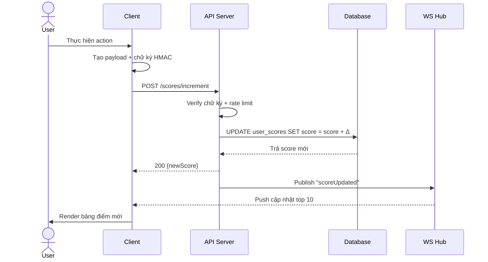

# 99Tech Code Challenge #1 #

Note that if you fork this repository, your responses may be publicly linked to this repo.  
Please submit your application along with the solutions attached or linked.   

It is important that you minimally attempt the problems, even if you do not arrive at a working solution.

## Submission ##
You can either provide a link to an online repository, attach the solution in your application, or whichever method you prefer.
We're cool as long as we can view your solution without any pain.

----------------------------------
BackEnd
link test: https://s5tech.notion.site/Code-Challenge-05cdb9e0d1ce432a843f763b5d5f7497

## Problem 4 – Sum to n

### Mô tả
Thư mục `src/problem4/index.ts` triển khai 3 biến thể của bài toán tính tổng `1 + … + n`:

- `sum_to_n_a`: dùng công thức Gauss `n(n+1)/2`.
- `sum_to_n_b`: duyệt tuyến tính và cộng dồn.
- `sum_to_n_c`: sinh mảng ảo với `Array.from` rồi `reduce`.  
Tất cả hàm đều:
1. Kiểm tra `n` phải là số nguyên (`Number.isInteger`), sai sẽ ném `TypeError`.
2. Trả `0` nếu `n <= 0` để tránh giá trị âm/không.

### Cách chạy thử

```bash
npm install        # nếu chưa cài phụ thuộc
npm run dev        # chạy script ts-node cho problem4
```

Script sẽ thực thi file `index.ts`; bạn có thể thêm khối `if (require.main === module)` để in mẫu:

```
if (require.main === module) {
  console.log('sum_to_n_a(10) =', sum_to_n_a(10));
  console.log('sum_to_n_b(10) =', sum_to_n_b(10));
  console.log('sum_to_n_c(10) =', sum_to_n_c(10));
}
```

### Kiểm thử nhanh
- Sử dụng `npx ts-node` hoặc Node REPL: `npx ts-node --transpile-only`, sau đó `import { sum_to_n_a } from './src/problem4/index'; sum_to_n_a(100);`.
- Có thể viết unit test bằng bất kỳ framework (Jest/Vitest). Trường hợp chưa có, đề xuất tạo file `src/problem4/index.test.ts` để đảm bảo đồng nhất giữa 3 phiên bản.

### Gợi ý cải tiến
1. Tách phần validate số nguyên thành helper dùng chung.
2. Thêm cache hoặc memoization nếu lời gọi lặp lại nhiều lần (dù đa số không cần vì thời gian nhỏ).
3. Viết benchmark nhỏ để so sánh hiệu năng giữa 3 giải pháp với các giá trị lớn.

## Problem 5 – A Crude Server

### Yêu cầu hệ thống

- Node.js >= 18

### Cài đặt phụ thuộc

```bash
npm install
```

### Chạy server

```bash
npm run problem5
```

Server mặc định chạy ở `http://localhost:3000` (có thể đổi cổng qua biến môi trường `PORT`).

### Các endpoint chính

- `POST /resources` – tạo resource mới. Body:

  ```json
  {
    "title": "Tên resource",
    "description": "Mô tả ngắn",
    "status": "draft | published | archived"
  }
  ```

- `GET /resources` – liệt kê resource với bộ lọc cơ bản:
  - `status` (draft/published/archived)
  - `q` (từ khóa tìm trong title/description)
  - `limit` (mặc định 20, tối đa 100)
  - `offset` (mặc định 0)

- `GET /resources/:id` – lấy chi tiết theo id.

- `PUT /resources/:id` – cập nhật một hoặc nhiều trường (ít nhất một trường).

- `DELETE /resources/:id` – xóa resource.

### Ghi chú kỹ thuật

- Dùng Express + TypeScript.
- Lưu trữ dữ liệu bằng SQLite (thông qua `better-sqlite3`). File DB nằm trong `src/problem5/resources.db`.

---------------------------------------------------------------------------------------
##Problem 6: Architecture
## Đặc tả module dịch vụ API – Live Scoreboard

### 1. Phạm vi và mục tiêu
- Cung cấp API backend cho bảng điểm top 10 người dùng.
- Hỗ trợ cập nhật điểm theo thời gian thực sau mỗi hành động của người dùng.
- Đảm bảo an toàn: chỉ người dùng hợp lệ mới tăng được điểm.

### 2. Kiến trúc đề xuất
- **App Server (Express + TypeScript)**  
  - REST API để cập nhật và truy vấn điểm.  
  - WebSocket (hoặc SSE) để đẩy live update đến client.  
  - Middleware xác thực chữ ký hành động (HMAC) + rate limiting.
- **Message/Event Layer**  
  - Dùng Redis Pub/Sub hoặc kênh nội bộ để broadcast cập nhật điểm cho tất cả tiến trình WebSocket.
- **Database**  
  - PostgreSQL/MySQL (hoặc Redis Sorted Set nếu ưu tiên tốc độ).  
  - Bảng `user_scores` lưu tổng điểm, lịch sử cập nhật để audit.

### 3. Luồng xử lý chính



### 4. Chi tiết API

| Endpoint | Method | Mô tả | Body/Query | Response |
|----------|--------|-------|------------|----------|
| `/scores/top` | GET | Lấy top 10 người điểm cao nhất | `?limit=10` (optional) | `{ data: [{userId, score}], fetchedAt }` |
| `/scores/increment` | POST | Tăng điểm sau action hợp lệ | `{ userId, delta, actionId, signedPayload }` | `{ scoreBefore, scoreAfter }` |
| `/scores/stream` | GET (SSE)/WS | Nhận live update | Header: `Authorization` | Stream các sự kiện `{ type: 'SCORE_UPDATED', payload }` |

### 5. Bảo mật & toàn vẹn
- **HMAC Signature**: Client ký payload bằng secret riêng (cấp khi đăng nhập). Server kiểm tra để ngăn sửa dữ liệu.
- **Nonce + actionId**: đảm bảo mỗi hành động chỉ được tính một lần.
- **Rate limiting**: Giới hạn số request tăng điểm theo phút/người dùng/IP.
- **Audit log**: lưu `userId`, `delta`, `actionId`, `ip`, `userAgent` để truy vết.

### 6. Đồng bộ real-time
- Khi điểm thay đổi, server push sự kiện lên Redis Pub/Sub.
- Mỗi tiến trình WebSocket đăng ký kênh `scoreboard_updates`, nhận sự kiện và gửi đến client đã subscribe.
- Client nhận dữ liệu và cập nhật UI ngay; fallback polling mỗi 5s nếu WS lỗi.

### 7. Yêu cầu phi chức năng
- **Độ trễ** cập nhật < 1s từ lúc user hoàn thành action.
- **Khả năng mở rộng**: có thể scale ngang app server; sử dụng Redis cluster cho pub/sub.
- **Khả năng chịu lỗi**: nếu WS bị mất kết nối, client tự động retry exponential backoff.

### 8. Ghi chú cải tiến thêm
1. **Gamification hooks**: thêm API `GET /scores/history` để hiển thị tiến trình theo ngày.
2. **Thông báo push**: tích hợp Web Push để nhóm người đứng top nhận thông báo.
3. **Phát hiện gian lận**: xây thêm worker phân tích hành vi bất thường dựa trên log.
4. **Blue/Green deploy**: đảm bảo không mất sự kiện khi deploy bằng cách dùng message queue bền vững.